# Development history

TeamCreator was developed locally before this repository was published on 27 September 2026. The initial public commit, [51f0e13](https://github.com/Lucian-Adrian/teamcreator-mvp/commit/51f0e13), contains the existing MVP. Earlier milestones below are recovered from dated local development records and synthetic screenshots. They are not claims that matching Git commits existed at those earlier times.

Subsequent commits preserve real changes in reviewable groups. Commit dates are their actual creation dates. The initial public history has not been rewritten.

## Product direction and implementation

Lucian directed the product, reviewed the interface, approved the v7 visual direction and requested the white simulation map. Codex and Luna agents implemented and checked the software under that direction. This page does not attribute agent implementation to Lucian's personal coding work.

## Milestones

### Simulation motion and loading performance

Lucian requested removal of the black selection boundary, left-to-right drawing, a more refined interface and faster, smoother loading. The black rectangle was the browser's default outline on a pointer-focused SVG endpoint. The fix preserves visible keyboard focus.

- `ebd5a27`: finite trace drawing and explicit replay, stable selection, memoized geometry, local hover state, clearer chart controls and inspector. All 24 sampled curve strings matched the previous version. Automatic motion respects reduced-motion settings; an explicit Play action requests one pass and then stops.
- `da5f050`: lazy Team, Simulation and Decisions routes, retained simulation state, manual page-load recovery, and optimized WebP display assets. [Asset provenance](public/brand/optimized-assets-manifest.json) records the derivation; original PNG artwork remains.
- `7a754c9`: shared surface and interaction polish with reduced-motion support.

Initial referenced JS, CSS and image files decreased from 1,967,125 to 853,774 uncompressed bytes (56.6%). Startup JS decreased 38.0% and initial CSS 44.6%. This comparison covers the Context startup assets, including the browser runtime and visible logos; route-only assets are deferred. It is not a network-latency benchmark.

Both production builds passed and matched. Browser checks covered pointer/keyboard focus, replay progression, no replay on selection, reduced-motion behavior, route/state retention, and desktop/mobile layout. Published as `2026-09-27-motion-performance`, Cloudflare `eee833eb-2a2c-4ccb-b06e-efac757daa50`.

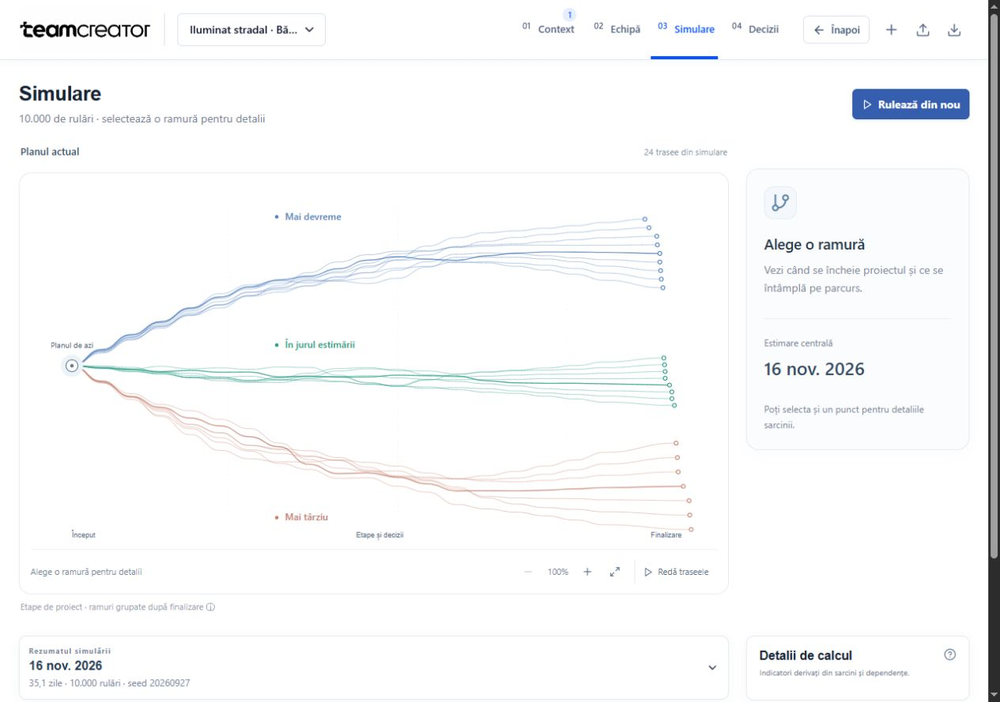

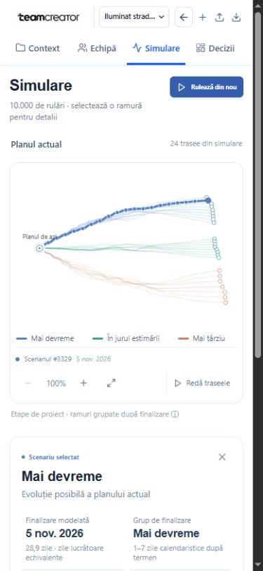

### Phone presentation and clearer relationships

Lucian asked for a cleaner map based on the pitch deck, useful relationship controls, quieter integration cards and a mobile version suitable for the hackathon judges.

- `a1f0ce5`: removed repeated demo badges and connection warnings from presentation integration cards, retained real host verification, and added keyboard focus handling to the setup dialogs.
- `52bc3d2`: compact portrait cards, rounded connections, person search, focused relationships, and automatic framing after nodes are measured. Phone and desktop positions are independent.
- `a2d47ab`: four visible project tabs on phones, a compact sticky header, and an explicit profile action that keeps selection from scrolling away from the map.
- `a58986d`: compact asymmetric simulation branches, readable family labels and larger touch controls.
- `458a356`: mobile source cards show all four lifecycle states; the desktop navigation labels fit at 1280px.

The 360px and 390px browser checks covered all four navigation labels, the people canvas without horizontal overflow, relation filtering and search. The Jira dialog passed initial focus, keyboard containment, Escape and focus restoration. A real sampled simulation run remained selectable on mobile. Production builds in both checkouts produce matching assets. Motion respects reduced-motion preferences.

Published as `2026-09-27-mobile-presentation`, Cloudflare version `cb537c75-7358-478f-82ff-a69037e0f6c2`. Desktop review additionally checked dragging a person with attached edges and reset. The navigation overlap found at 1280px was corrected and checked in the final build.

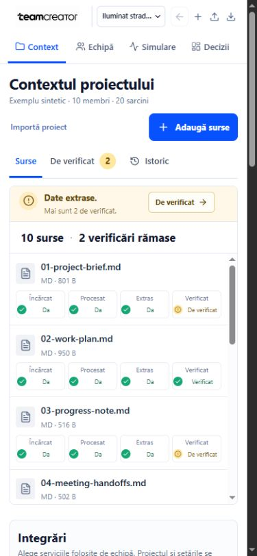

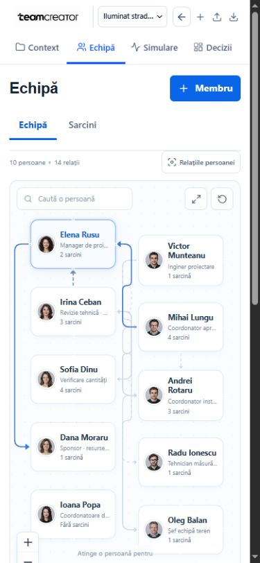

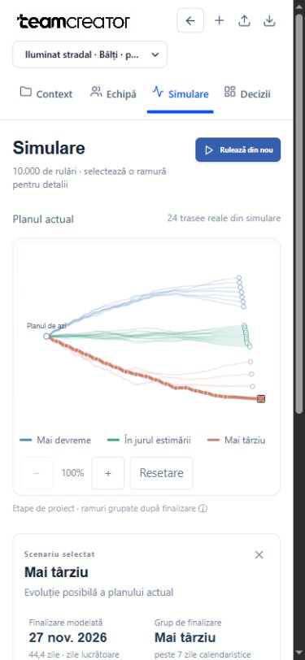

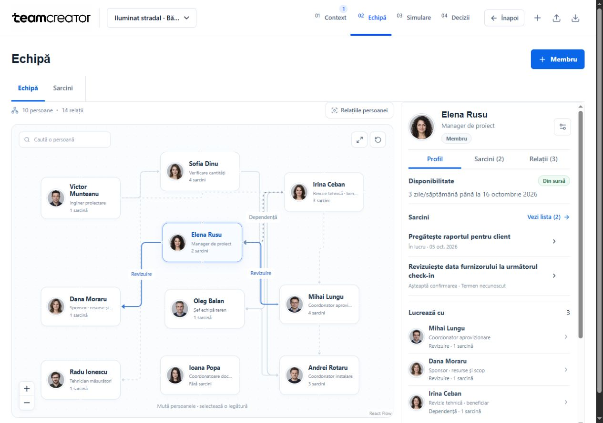

### Connected team canvas after the second review

Lucian rejected the large profiles and detached arrows in the people map, requested generated portraits for every person, and then explicitly asked to replace the implementation with a canvas of connected people.

- `9ed001a`: ten generated synthetic portraits, a shared avatar renderer and a check that real people/custom photos are not replaced. The [portrait manifest](public/brand/team-portraits-v2-manifest.json) records the ImageGen prompt and cell order.
- `1172b8b`: replaced the hand-positioned SVG map with a React Flow canvas. People can be dragged, connections follow their handles, and pan/zoom/fit/reset are available. Layout and viewport are saved per browser project. Node handles are remeasured on mount to fix missing edges after reload in the embedded browser.
- `3776794`: compact profile summaries, separate field and general evidence, task-only counts, persisted profile tabs and a mobile return-to-map action. At narrow widths the map appears before the profile.

The source builds in both checkouts produce matching assets. Fourteen focused tests pass, including synthetic-only portrait assignment. Browser verification covers selection without reshuffling people, dragging with moving edge endpoints, pan/zoom/reset, relationship navigation and reload. The earlier fixed geometry implementation and its large cards are superseded.

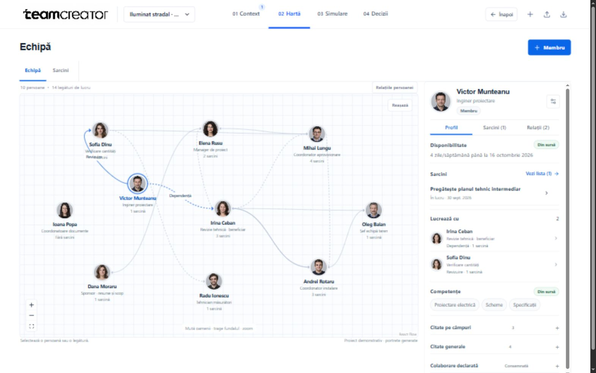

### Earlier milestones

| Date of source record | Problem or decision | Delivered change and evidence |
|---|---|---|
| 26 September 2026 | A project manager needed to trace people, tasks and decisions back to documents. | Local source ingestion, reviewable proposals, dependencies and a synthetic streetlight project. Recovered from the local changelog dated 26 September; the resulting source is in the initial public commit. |
| 27 September 2026, first Live release | A browser demo needed to work without exposing the local project store. | Separate browser storage, deterministic table intake, Monte Carlo, reports and a dedicated Worker. The recorded first Cloudflare version was `8097f3b7-8ef5-4d48-a960-8b90fcbfa875`. |
| 27 September 2026, visual review | Lucian found the first interface too far from the proposed images. | The approved v7 direction was applied across Context, people and task views, decisions and report previews. Current synthetic captures are below. |
| 27 September 2026, source release | The MVP needed a public, portable source package. | A fresh repository with 78 explicitly selected source/configuration/asset files, a portable Worker configuration and no runtime project data. Initial commit: [51f0e13](https://github.com/Lucian-Adrian/teamcreator-mvp/commit/51f0e13). |
| 27 September 2026, simulation review | Sample labels could misstate a run's empirical rank; a remaining-work forecast needed correlated run data. | Actual completion ranks and full-sample remaining-work quantiles, with focused tests: [45dc529](https://github.com/Lucian-Adrian/teamcreator-mvp/commit/45dc529). |
| 27 September 2026, intake review | Upload progress could reach 100% before processing finished, and history mixed languages. | Progress stays below completion until the service responds; source/history labels are localized: [a7dbb1d](https://github.com/Lucian-Adrian/teamcreator-mvp/commit/a7dbb1d). |
| 27 September 2026, profile and mobile review | Saving an unchanged profile field could disturb its evidence; the selected member could be hard to reach on mobile. | Save only changed fields and bring the selected member inspector into view: [68331d3](https://github.com/Lucian-Adrian/teamcreator-mvp/commit/68331d3). |
| 27 September 2026, forecast review | The burndown needed the full-sample forecast and small deadline risks must remain visible. | Connected the correlated forecast and kept one decimal place for probabilities: [857f242](https://github.com/Lucian-Adrian/teamcreator-mvp/commit/857f242). |
| 27 September 2026, simulation interface review | Lucian rejected dark simulation concepts. An earlier white plot also placed the chart too low and did not show a common starting point. | A white diagram with a shared origin, actual sampled runs, task selection, completion-group filters, zoom, pan and a side inspector: [c4d2a1a](https://github.com/Lucian-Adrian/teamcreator-mvp/commit/c4d2a1a). |
| 27 September 2026, report review | The client report footer fell below the desktop preview, and renamed sources could leave stale draft labels. | Tighter desktop spacing and source-name-sensitive draft updates: [297a305](https://github.com/Lucian-Adrian/teamcreator-mvp/commit/297a305). |

## Presentation revision after live testing

Lucian tested the MVP and requested working Back navigation, a prepared project at startup, integrations inside Context, a clearer task list, repaired team-map interaction and a simpler simulation. These changes are preserved in seven additional implementation commits:

- `1b6c13a`: expanded cited presentation fixture and explicitly unconfirmed simulation assumptions.
- `46a3222`: idempotent presentation startup and correct reference cloning.
- `3b718d3`: working relationship clicks, unclipped people map and grouped task list.
- `d8d1433`: direct project entry, URL navigation state, browser Back and removal of the Agent badge.
- `f543caf`: inline branded integration dialogs and extraction-review status.
- `331bd40`: asymmetric branches, click-open inspector and simulation controls below the map.
- `7823e5c`: release identifier `2026-09-27-presentation-ux`.

The versioned synthetic case includes 10 people, 20 tasks, 10 sources, recorded completion history and two pending proposals with field-supporting quotations. A 10,000-run baseline is prepared automatically. Clicking a branch opens its own details; there is no scenario checklist. Branch geometry follows actual task-finish differences within empirical completion groups, with no numeric vertical time axis.

Focused verification: 13 tests passed across the browser runtime, presentation fixture and Worker boundary. Production builds in both checkouts produced matching JS/CSS filenames. Desktop and mobile browser checks covered Back, member and relationship selection, task/source navigation, Jira configuration persistence, modal close/Escape, nine loaded vendor logos and branch selection. Agents compared the desktop views against the approved visual direction. Configuration dialogs remain local setup; external accounts and public AI are not connected by this release.

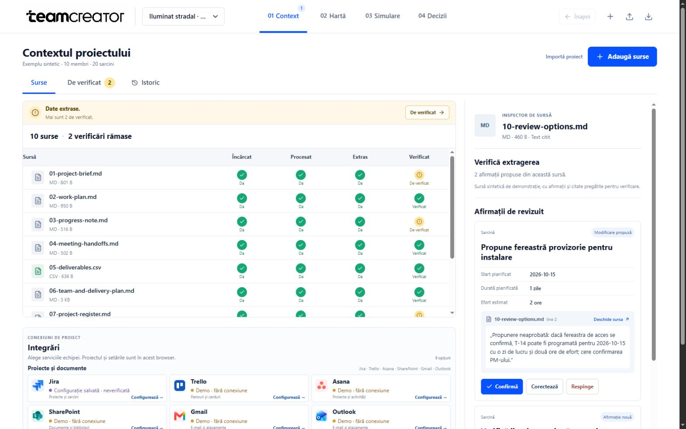

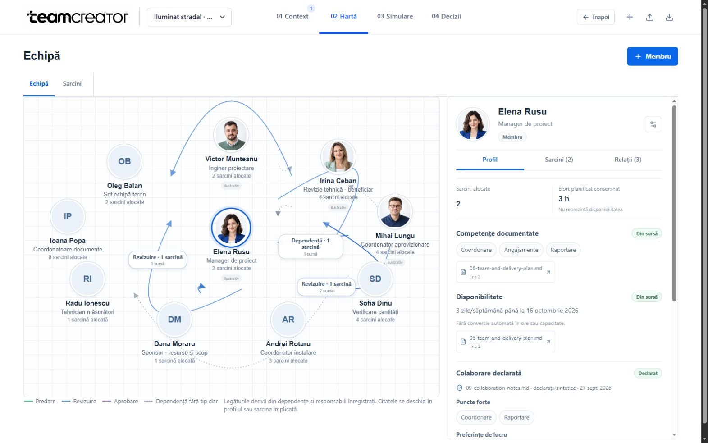

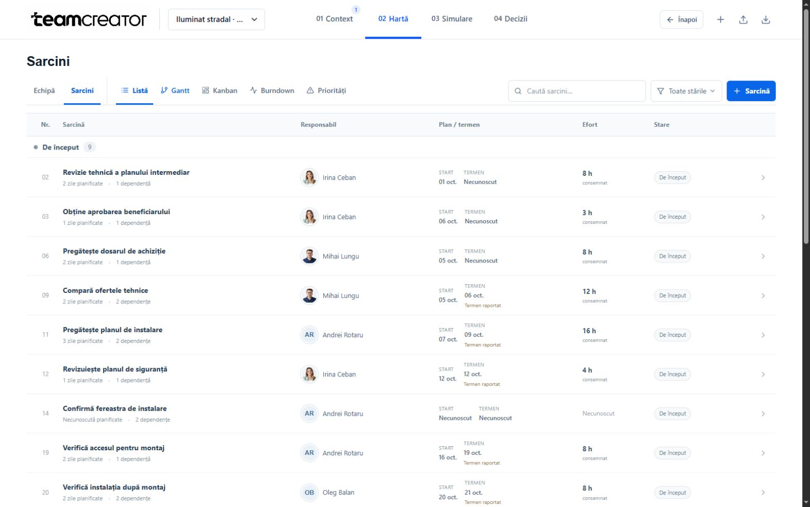

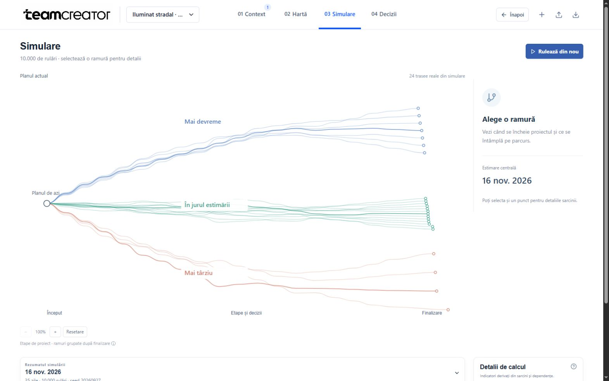

## Earlier synthetic snapshots

These are application captures recovered from the 27 September local verification session. People, documents, dates and portraits belong to the synthetic demo. Screenshots are evidence of the rendered views at that point; they do not establish customer use or successful external integrations.

### Context and source review


### People and responsibilities


### Simulation before the final visual correction

The earlier view used task finish days vertically and placed a long legend above the chart. This recovered snapshot explains the correction; it is not the current interface.


### White simulation map

The horizontal direction follows task stages. The vertical layout groups sampled runs by their empirical completion third. It is a diagram layout, without a numeric time scale or inferred cause of delay. Dates and durations are shown for the actual selected run.


### Client report


## Verification recorded on 27 September 2026

- Production TypeScript/Vite builds passed in both the working project and the separate public checkout.
- 27 focused tests passed for simulation, collaboration validation, the isolated records API, reports and browser parsing/storage. The Worker boundary check passed separately, for 28 focused checks in this revision.
- Browser checks covered a real synthetic CSV file selection, correction, selective acceptance, rejection, reload persistence and retained profile citations.
- A paired 10,000-run intervention reduced the final task by one modeled day. In that saved test workspace, baseline P50 was 21 days and intervention P50 was 20 days, using paired random draws. This is a model result, not an observed delivery improvement.
- The white map was checked at 1586 × 992 and in a 390 × 844 mobile viewport. A separate Luna review found no blocking visual issue. The mobile overview remains small at default zoom; zoom, pan and the run list provide access.
- Family filtering, keyboard task selection, modeled start/finish dates, zoom, pan and reset were exercised in the browser. The burndown displays the forecast separately from confirmed completion history.

To repeat the focused checks from this checkout:

```sh
npm ci
npm run build:live
node --import tsx --test shared/simulation.test.ts shared/collaboration-profile.test.ts server/records-api.test.ts frontend/src/project-report.test.ts frontend/src/public-parser.test.ts frontend/src/public-runtime.test.ts live-worker.test.mjs
```

## Current boundaries

Public AI still requires project-owned API access, a configured model and Cloudflare Access. Integration cards show setup requirements; they do not demonstrate connected Jira, Trello, mail or assistant accounts. The local agent adapter is not an installed assistant plugin. Reports and message drafts remain unsent until a person acts.

The public repository excludes private source documents, local project stores, internal conversation records and credentials. The screenshots above contain synthetic application content only.

[Browse the complete public commit history](https://github.com/Lucian-Adrian/teamcreator-mvp/commits/main/)
